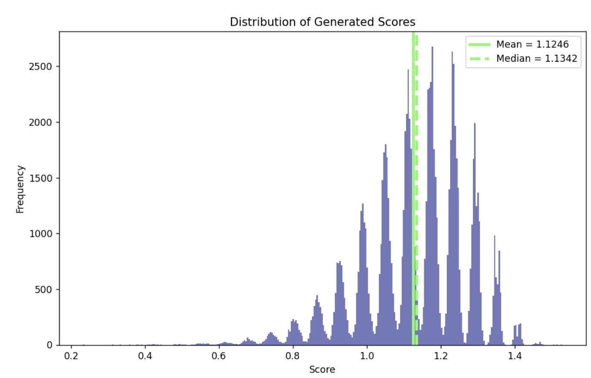
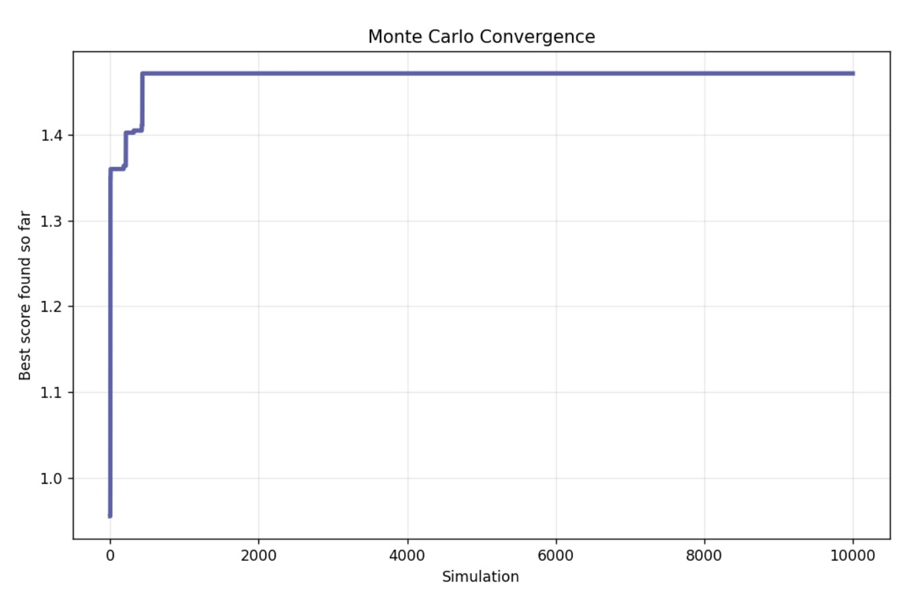
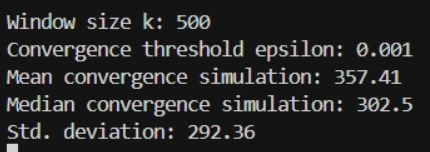
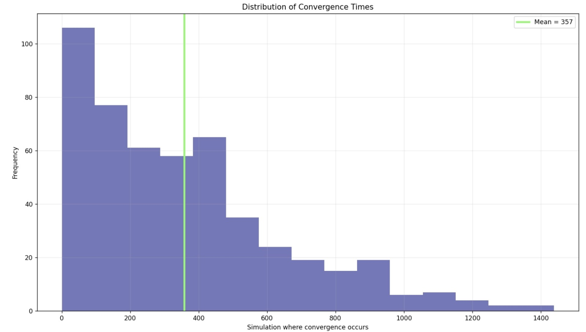

# Phasing Generator

## Table of Contents

* [Description](#description)
* [Code Overview](#code-overview)

  * [Score Function](#score-function)
  * [Statistical Analysis of the Search Space](#statistical-analysis-of-the-search-space)
  * [Monte Carlo Convergence Analysis](#monte-carlo-convergence-analysis)

* [Example](#example)

---

# Description

*Piano Phase* is a famous musical work by [Steve Reich](https://en.wikipedia.org/wiki/Steve_Reich).

The idea behind the piece is relatively simple: two pianists begin by playing the exact same sequence of notes. One performer keeps repeating the sequence unchanged, while the other gradually shifts out of phase by rotating the sequence over time, until both performers eventually realign.

Even though the concept is simple, the resulting texture is highly hypnotic and constantly evolving.

As you might imagine, the brilliance of the piece comes from the fact that not every melodic sequence sounds good when played simultaneously against all of its possible rotations. Finding a sequence that works well under every phase shift can become a very tedious task — so this project approaches the problem algorithmically.

This project is a sequence generator specifically designed to create pieces inspired by *Piano Phase*, using randomized simulation and musical scoring heuristics.

---

# Code Overview

The user provides the following inputs:

* The number of notes in the sequence
* Whether to manually choose a musical scale or let the program select one randomly
* The rhythmic duration of the notes
* The number of simulations (*k*)

The program generates *k* random sequences and evaluates them using a custom score function that estimates how well the sequence behaves under phasing transformations.

The final output includes:

* A functional sequence for generating a *Piano Phase*-style piece, both as MIDI note numbers and symbolic note notation
* A `.mid` file ready to import into any DAW or notation software

---

## Score Function

What does it mean for a sequence to “sound good” in this context?

The main metric comes from assigning a score to the intervallic difference (measured in MIDI semitones) between notes played simultaneously by the two phased sequences.

The interval weighting system is inspired by psychoacoustic and music-theoretical models of consonance and dissonance. Intervals are assigned continuous weights based on perceived stability, tension, and spectral roughness rather than strict tonal hierarchy.

The interval score table used in the current implementation is:

| Semitone Difference | Interval Name  | Perception         | Weight |
| ------------------- | -------------- | ------------------ | ------ |
| 0                   | Unison         | Neutral / stable   | 0.60   |
| 1                   | Minor Second   | Tense              | 0.55   |
| 2                   | Major Second   | Open / floating    | 0.60   |
| 3                   | Minor Third    | Cold / melancholic | 0.65   |
| 4                   | Major Third    | Bright             | 0.60   |
| 5                   | Perfect Fourth | Stable             | 0.70   |
| 6                   | Tritone        | Ambiguous / tense  | 0.75   |
| 7                   | Perfect Fifth  | Stable             | 0.65   |
| 8                   | Minor Sixth    | Warm               | 0.70   |
| 9                   | Major Sixth    | Soft               | 0.65   |
| 10                  | Minor Seventh  | Tense              | 0.60   |
| 11                  | Major Seventh  | Sharp / unstable   | 0.60   |

Naturally, there is no single “correct” way to assign these weights.

The interval values used here are intentionally non-tonal and were tuned empirically to generate minimalist phasing textures closer to Steve Reich’s aesthetic rather than traditional tonal harmony.

One of the most interesting aspects of the project is that the user can freely modify these weights to create completely different musical moods — for example, making the generated material brighter, darker, more tense, more unstable, or more unpredictable.

For users interested in experimenting further with consonance/dissonance models, I strongly recommend reading [this paper](https://www.researchgate.net/publication/276905584_Measuring_Musical_Consonance_and_Dissonance).

In addition to the interval weighting system, the score function also evaluates:

* Pitch variety
* Intervallic variety (diversity in melodic jumps)
* A repetition penalty to avoid excessive repeated notes

The code is thoroughly documented so users can easily tweak the relative weights of each metric and explore different musical behaviors.

---

## Statistical Analysis of the Search Space

The main script is designed to find the highest-scoring sequence among a large set of randomly generated candidates.

However, an important question naturally arises:

<i>What does the space of generated sequences actually look like statistically?</i>

To investigate this, we performed 10,000 simulations using the random search mode on sequences of fixed length 12.

The sequence length was intentionally fixed because comparing scores across sequences of different lengths would not be statistically meaningful, as the score function itself depends on sequence size.

The resulting score distribution exhibited several interesting statistical properties.

The main summary statistics were:

| Metric | Value |
| --- | --- |
| Mean score | 1.1246 |
| Median score | 1.1342 |
| Standard deviation | 0.1424 |
| Skewness | -0.6633 |
| Maximum score | 1.5282 |
| Minimum score | 0.2324 |

The code used for the statistical analysis is located in the `statistics` folder.

As with the main generator, the implementation is fully generalized so the same analysis can be performed for arbitrary sequence lengths and arbitrary numbers of simulations.

Plotting the empirical score distribution produced the following result:

  

The distribution resembles a kind of *comb distribution*: globally, it approximately follows a negatively skewed normal distribution, but locally it appears fragmented into multiple smaller bell-shaped regions.

This behavior likely emerges from the discrete combinatorial structure of the score function and the finite interval vocabulary used in the evaluation process.

Regardless of this unusual structure, one important fact becomes immediately clear:

<b>High-scoring sequences are extremely rare.</b>

This observation motivates the following practical question:

<i>How many simulations are actually necessary before the search process effectively stops improving?</i>

To answer this question, we performed a Monte Carlo convergence analysis based on extreme-value stabilization of the best score found during the search process.

---

## Monte Carlo Convergence Analysis

As expected, increasing the number of simulations generally leads to higher maximum scores, meaning that the algorithm is more likely to discover musically “better” sequences. However, this improvement only occurs up to a certain point, after which the maximum score begins to stabilize, as illustrated in the following figure:

  

Different runs produce curves with the same overall behavior, although the stabilization point varies due to the stochastic nature of the algorithm. To formally define convergence, we introduce a **stagnation-based stopping criterion**.

Let

$$
S_{\max}(N) = \max\{S_1,S_2,\dots,S_N\}
$$

denote the best score found after \(N\) simulations.

We then define the score improvement over an additional window of \(k\) simulations as

$$
\Delta S = S_{\max}(N+k) - S_{\max}(N)
$$

where:

* \(N\) is the current number of simulations,
* \(k\) is a fixed future simulation window,
* \(\Delta S\) measures the improvement in the best score after continuing the search.

We say that the algorithm has converged whenever

$$
\Delta S < \varepsilon
$$

for some sufficiently small threshold \(\varepsilon > 0\).

Intuitively, this means that further simulations no longer produce significant improvements in the best sequence found.

Using:

* number of runs = 500,
* window size \(k = 500\),
* convergence threshold \(\varepsilon = 0.001\),

(the code is fully configurable, so users may freely modify these parameters), we obtain the following results:

  

  

Let \(T_c\) denote the convergence time, i.e., the number of simulations required for the stopping criterion to be satisfied.

Since each Monte Carlo run produces a different value of \(T_c\), the convergence time itself is treated as a random variable.

Although the underlying distribution of \(T_c\) is unknown, the use of 500 independent Monte Carlo runs allows us to invoke the **Central Limit Theorem (CLT)**.

Therefore, the sampling distribution of the sample mean converges in distribution to a Gaussian distribution, making it possible to construct a confidence interval for the expected convergence time.

The standard error is given by

$$
SE = \frac{\hat{\sigma}}{\sqrt{n}}
$$

where:

* \(\hat{\sigma}\) is the sample standard deviation,
* \(n\) is the number of independent Monte Carlo runs.

A 95% confidence interval for the expected convergence time is therefore:

$$
\hat{\mu}_{T_c} \pm 1.96 \cdot \frac{\hat{\sigma}}{\sqrt{n}}
$$

Using the observed statistics:

* \(\hat{\mu}_{T_c} = 357.41\)
* \(\hat{\sigma}_{T_c} = 292.36\)
* \(n = 500\)

we estimate the expected convergence time to be:

$$
\mathbb{E}[T_c] \approx 357.41
$$

with the following 95% confidence interval:

$$
331.77 \leq \mathbb{E}[T_c] \leq 383.05
$$

This result suggests that, under repeated Monte Carlo trials, the algorithm typically reaches practical convergence after approximately 350 simulations, after which additional simulations produce only marginal improvements in the maximum score.

---

# Example

Below is an example generated by the algorithm and rendered using the `musicntwrk` library by [@marcobn](https://github.com/marcobn).

The video demonstrates how a single generated sequence evolves through progressive phase shifting, creating constantly changing rhythmic and harmonic interactions from extremely limited material.

To visualize the generated phasing structure as notation and MIDI playback, see `visualize.py`.
